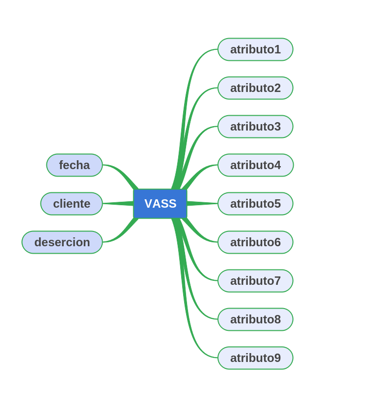
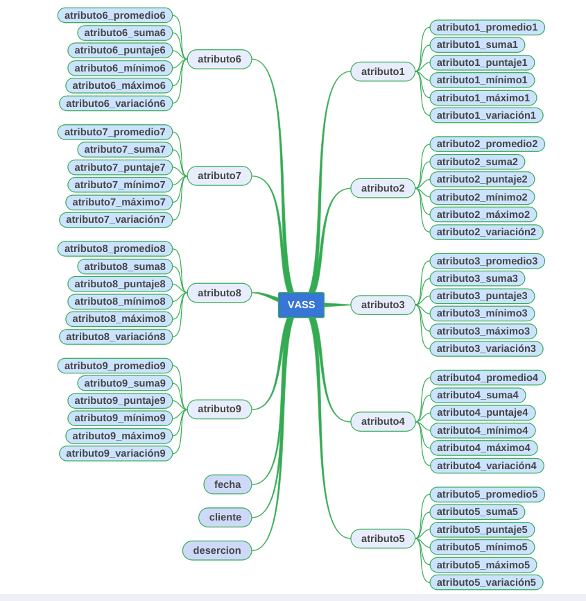

Usar Machine learning para reducir la deserción de clientes.

## Background
El Banco Central busca encontrar patrones ocultos en la información de sus clientes
capturada por la interacción que tiene en su página web.
Ha sido contratado para determinar el momento en el que se debe iniciar una acción de
retención por parte de los gestores, evitando así la deserción de los actuales clientes.
Goal
Crear un modelo usando Machine Learning para predecir la probabilidad de deserción de
los clientes. Al crear el modelo, se deben determinar cuáles deben ser las métricas a tener
en cuenta y su criterio de selección. La columna que se ha de predecir es “deserción” con
valor binario “0” para no-desercion y “1” para desercion
Code
La idea es validar cómo se aborda la solución del problema y las técnicas usadas para
procesar la información en python.
Data
Usar dataset “desercion.csv”.

## Metadata
Columna Descripcion
fecha fecha en formato “YYYY-MM-DD
cliente Identificador de cliente
desercion Flag de deserción
atributo 1 a 9 Features de interacción con la página web.

## Compute
El dataset es lo suficientemente pequeño para trabajar en tu ordenador personal con
herramientas opensource, como Jupyter Notebooks.
Report
Por favor entregar un documento PDF con los descubrimientos a través del proceso +
código/o Markdown.

## Comments
- Recuerde que los atributos 1 a 9 son features de interacción web, por lo cual están
un poco codificados.
- El dataset no está balanceado, por ello se requiere un análisis adicional para la
selección de train-test, no sólo por criterios de fecha.
- No hay una limitación para la estrategia de análisis, sólo se debe recordar la
necesidad de explicar su línea de pensamiento para la solución del problema.

## Análisis y Solución
================================================================================



Para abordar el problema de reducir la deserción de clientes utilizando Machine Learning, podemos seguir los siguientes pasos:

# 1. Análisis exploratorio de datos: 
Comenzaremos explorando el dataset "desercion.csv" para comprender mejor la estructura de los datos y realizar algunas visualizaciones. Esto nos ayudará a obtener información sobre la distribución de las variables, identificar valores atípicos y comprender la relación entre las características y la variable objetivo "desercion".

# 2. Preprocesamiento de datos: 
En esta etapa, realizaremos las siguientes tareas:
   ## - Manejo de datos faltantes: 
   Verificaremos si existen valores faltantes en el dataset y decidiremos cómo manejarlos (por ejemplo, imputación de valores faltantes o eliminación de filas/columnas).
   ## - Codificación de variables: 
   Si los atributos 1 a 9 están codificados, podemos realizar una decodificación para comprender mejor su significado y facilitar su interpretación durante el modelado.
   ## - Balanceo de datos: 
   Dado que el dataset no está balanceado en términos de la variable objetivo, debemos considerar estrategias para equilibrar los datos antes de entrenar el modelo. Esto podría implicar técnicas como submuestreo de la clase mayoritaria o sobremuestreo de la clase minoritaria.

# 3. Selección de características: 
Analizaremos las características disponibles en el dataset y evaluaremos su relevancia para predecir la deserción de los clientes. Podemos utilizar técnicas de selección de características, como la correlación con la variable objetivo o modelos de selección automática de características, para determinar las características más importantes.


# 4. División de datos: 
Dividiremos el dataset en conjuntos de entrenamiento y prueba. Dado que se menciona que no solo se debe considerar la fecha para la división de datos, podemos utilizar técnicas como la selección aleatoria estratificada o la división temporal combinada con otros criterios.

# 5. Construcción del modelo: 
Utilizaremos algoritmos de Machine Learning para construir un modelo predictivo de la probabilidad de deserción de los clientes. Algunos algoritmos comunes que podrían ser adecuados para este problema incluyen Regresión Logística, Árboles de Decisión, Bosques Aleatorios o Gradient Boosting. Seleccionaremos el algoritmo y ajustaremos los hiperparámetros utilizando técnicas como la validación cruzada y la búsqueda en cuadrícula para optimizar el rendimiento del modelo.

# 6. Evaluación del modelo: 
   Evaluaremos el modelo utilizando métricas apropiadas para problemas de clasificación binaria, como precisión, recall, F1-score y área bajo la curva ROC (AUC-ROC). También podemos generar una matriz de confusión para tener una visión más deNormalización de atributos numéricos: dado que sus atributos varían en diferentes escalas, la normalización o estandarización de atributos numéricos (atributo1 a atributo9) ayudará a garantizar que todas las variables estén en la misma escala. Esto es especialmente importante para los algoritmos que son sensibles a la escala de los datos, como los que se basan en la distancia (por ejemplo, k-NN) y los algoritmos de descenso de gradiente.

   ## Extracción de información temporal: 
   si la columna "cerrar" contiene información de fecha, puede extraer características temporales relevantes, como el día de la semana, el mes, el trimestre o la estación. Esta información puede ayudar al modelo a capturar patrones estacionales o comportamientos cíclicos que pueden afectar la deserción de los clientes.

   ## Creación de variables agregadas: 
   cree nuevas columnas para representar estadísticas de resumen para los atributos de interacción (atributo1 a atributo9). Puede agregar columnas para la media, máxima, mínima y desviación estándar para cada atributo. Estas características agregadas pueden capturar información importante sobre el comportamiento del cliente.

   ## Creación de variables ficticias: 
   si la columna "cliente" contiene información categórica, como identificadores de clientes, puede crear variables ficticias para representar cada categoría. Esto permitirá que el modelo capture los efectos de diferentes clientes en la deserción.

   ## Selección de características: 
   Realice un análisis exploratorio de los datos y, si es posible, aplique técnicas de selección de características para identificar qué atributos son más relevantes para predecir la deserción de los clientes. Esto puede ayudar a reducir la cantidad de funciones y evitar el sobreajuste.

   ## Ingeniería de funciones basada en dominios: 
   si tiene conocimientos especializados sobre el dominio del problema, utilice esos conocimientos para crear funciones más significativas y relevantes para la predicción. Por ejemplo, si sabe que ciertos comportamientos de los clientes son fuertes indicadores de deserción, cree características específicas para capturar esos comportamientos.tallada de las predicciones del modelo.

# 7. Interpretación del modelo: 
Si es posible, trataremos de interpretar el modelo para comprender qué características son más influyentes en las predicciones de deserción. Esto puede ayudar a obtener información adicional sobre los factores que contribuyen a la deserción de los clientes.

# 8. Implementación y seguimiento: 
Una vez que hayamos construido y evaluado el modelo, podremos implementarlo en producción y utilizarlo para predecir la probabilidad de deserción de nuevos clientes. Es importante realizar un seguimiento y evaluación periódicos para asegurarse de que el modelo sigue siendo efectivo a medida que los datos cambian con el tiempo.

Para llevar a cabo este proyecto, puedes utilizar bibliotecas de Python como pandas, scikit-learn y matplotlib/seaborn para el análisis exploratorio de datos, preprocesamiento, construcción del modelo y evaluación. También puedes utilizar Jupyter Notebooks para documentar y presentar tu trabajo en forma de código y markdown.

================================================================================

OBS:
## Datos desequilibrados: 
el conjunto de datos no está equilibrado en términos de la clase de deserción. Esto puede afectar el rendimiento del modelo de aprendizaje automático, ya que puede tener una tendencia a favorecer a la clase mayoritaria. Un enfoque para abordar este desequilibrio es utilizar técnicas de muestreo, como el sobremuestreo (aumento del número de muestras de la clase minoritaria) o el submuestreo (reducción del número de muestras de la clase mayoritaria). Puede considerar la biblioteca de aprendizaje desequilibrado de scikit-learn para realizar estas técnicas.

## Recursos de interacción web: 
las columnas 1 a 9 son recursos de interacción web. Sin embargo, se mencionó que estas columnas están un poco codificadas. En este caso, es importante comprender la naturaleza de estas codificaciones. Si tiene acceso a la información completa sobre estas funciones, puede realizar un análisis adicional para comprender qué significan y cómo pueden afectar las deserciones de los clientes. Según la naturaleza de estas funciones, es posible que deba aplicar técnicas de preprocesamiento adicionales, como la codificación de variables categóricas o la normalización de datos numéricos.

## Selección de funciones: 
además de las columnas de interacción web, es importante considerar si existen otras funciones relevantes para predecir la deserción de los clientes. Puede explorar técnicas de selección de características, como el análisis de importancia de características, para identificar las variables más relevantes para el problema en cuestión.

## Métricas de evaluación: 
además de las métricas estándar, como exactitud, precisión, recuperación y puntaje F1, puede considerar otras métricas específicas para problemas de clasificación desequilibrada. Algunas métricas útiles incluyen el área bajo la curva ROC (AUC-ROC) y la sensibilidad equilibrada (precisión equilibrada), que consideran la proporción de verdaderos positivos y verdaderos negativos de manera uniforme.

El conjunto de datos tiene las siguientes columnas: "cierres" (datos), "cliente" (identificador de cliente), "deserción" (valor binario que indica deserción) y atributos desde "atributo1" a "atributo9".

La columna "cliente" parece ser un identificador único para cada cliente. Puede ser útil identificar patrones específicos de deserción para clientes individuales.

La columna "deserción" es la columna de destino que indica si un cliente ha desertado o no, con el valor 0 que representa ninguna deserción y 1 representa la deserción.

Las columnas de "atributo1" a "atributo9" representan características del cliente o su interacción en la web. Sin embargo, no tenemos información sobre qué representan exactamente estos atributos tal como están codificados. Es importante obtener más información sobre el significado de estos atributos para realizar un análisis adecuado.

El conjunto de datos dado parece estar organizado por fecha (columna "cierra"). Esto puede ser útil para identificar tendencias o patrones de deserción a lo largo del tiempo.

En función de estas observaciones, puede seguir los pasos mencionados anteriormente para preprocesar los datos, realizar el entrenamiento y la división del conjunto de pruebas, entrenar un modelo de aprendizaje automático y evaluar su rendimiento. Sin embargo, tenga en cuenta que se requiere información adicional sobre el significado de los atributos para realizar un análisis más preciso y relevante.

Entrenar un modelo sin conocer el significado exacto de los atributos 1-9 puede ser un desafío, ya que la falta de comprensión de estos atributos puede dificultar la interpretación de los resultados y limitar la efectividad del modelo. Sin embargo, es posible realizar un análisis exploratorio de los datos para intentar comprender el patrón de deserción a partir de la información disponible.

# Análisis de correlación: 
compruebe si existe una correlación entre los atributos 1-9 y la columna de defectos. Puede utilizar técnicas como el coeficiente de correlación de Pearson o la prueba de correlación de rango para evaluar la asociación entre estos atributos y la deserción del cliente.

# Ingeniería de funciones: 
incluso sin conocer el significado exacto de los atributos, puede intentar crear nuevas funciones en función de la información disponible. Por ejemplo, puede crear funciones de agregación como promedio, suma, mínimo o máximo para los atributos existentes. Estas nuevas características pueden proporcionar una idea del patrón de deserción.

## Agregación estadística: 
 puede calcular varias estadísticas descriptivas de los atributos existentes, como la media, la mediana, la desviación estándar, el mínimo, el máximo y el conteo. Estas estadísticas pueden proporcionar información resumida sobre atributos y ayudar a capturar patrones relevantes.

 
   
   # Identifique atributos relevantes: 
   comience identificando qué atributos desea agregar estadísticamente. Esto puede incluir los atributos numéricos disponibles en el conjunto de datos.

   # Seleccione estadísticas para calcular: 
   elija estadísticas que sean relevantes para su problema. Algunos ejemplos comunes incluyen media, mediana, desviación estándar, mínimo, máximo y conteo. También puede considerar otras estadísticas específicas, según el contexto y los datos.

   # Agrupe los datos: 
   según la estructura de los datos, es posible que deba agrupar los datos según algunos criterios, como el cliente o el período de tiempo. Por ejemplo, puede calcular estadísticas agregadas para cada cliente o para cada mes.

   # Calcular estadísticas: 
   aplica estadísticas seleccionadas a datos agrupados. Utilice funciones estadísticas disponibles en bibliotecas como pandas para calcular las estadísticas deseadas. Por ejemplo, puede usar la función mean() para calcular la media, std() para la desviación estándar y count() para el conteo.

   # Crear características agregadas: 
   según las estadísticas calculadas, cree nuevas características agregadas para cada grupo. Estas características se agregarán al conjunto de datos como nuevas columnas. Por ejemplo, podría tener una nueva columna llamada "atributo1_promedio" que represente el promedio de "atributo1" para cada cliente.
   

   Uso de las características agregadas en el modelo: ahora que ha creado las características agregadas, puede usarlas para entrenar el modelo. Estas nuevas funciones pueden proporcionar información útil para predecir la deserción de clientes y mejorar el rendimiento del modelo.

## Relaciones temporales: 
dado que el conjunto de datos está organizado por fecha, puede explotar las relaciones temporales para crear características. Por ejemplo, puede calcular el promedio o la suma de atributos durante un período de tiempo anterior a la fecha actual para capturar tendencias de tiempo.

## Creación de índices: 
en función de los atributos disponibles, puede crear índices o proporciones que representen una relación entre diferentes atributos. Por ejemplo, la relación entre dos atributos o la diferencia entre ellos puede proporcionar información adicional sobre el comportamiento del cliente.

## Codificación de datos categóricos: 
si hay atributos categóricos en los datos, puede aplicar técnicas de codificación adecuadas, como la codificación one-hot, para representar estos atributos numéricamente e incorporarlos al modelo.

## Interacción entre atributos: 
Puede crear características que representen la interacción entre diferentes atributos. Por ejemplo, puede multiplicar o combinar dos atributos para crear una nueva característica que capture su interdependencia.

## Transformaciones matemáticas: 
en algunos casos, la aplicación de transformaciones matemáticas a los atributos existentes puede revelar patrones o hacer que los datos sean más adecuados para el modelado. Por ejemplo, aplicar el logaritmo o la raíz cuadrada puede ayudar a lidiar con distribuciones sesgadas.

## Binning: 
si los atributos continuos tienen una amplia gama de valores, puede agruparlos en intervalos discretos (binning) y crear entidades que representen estos intervalos. Esto puede ayudar a capturar información sobre diferentes rangos de valores.

# Experimentación y evaluación iterativa: 
incluso sin comprender completamente los atributos, puede iterar a través del proceso de entrenamiento del modelo y evaluar su rendimiento. Al realizar múltiples iteraciones, puede ajustar hiperparámetros, probar diferentes algoritmos de aprendizaje automático y explorar diferentes técnicas para preprocesar los datos. Esto puede ayudar a identificar qué atributos tienen el mayor impacto en la predicción de la deserción, incluso sin conocer su significado exacto.

Sin embargo, es importante señalar que tener una comprensión completa de los atributos ayudaría a mejorar la calidad del modelo y permitiría una interpretación más precisa de los resultados. Se recomienda buscar información adicional sobre los atributos o consultar con expertos en el dominio para obtener una comprensión más profunda y realizar un análisis más informado de los datos.

## CODE


```

```

